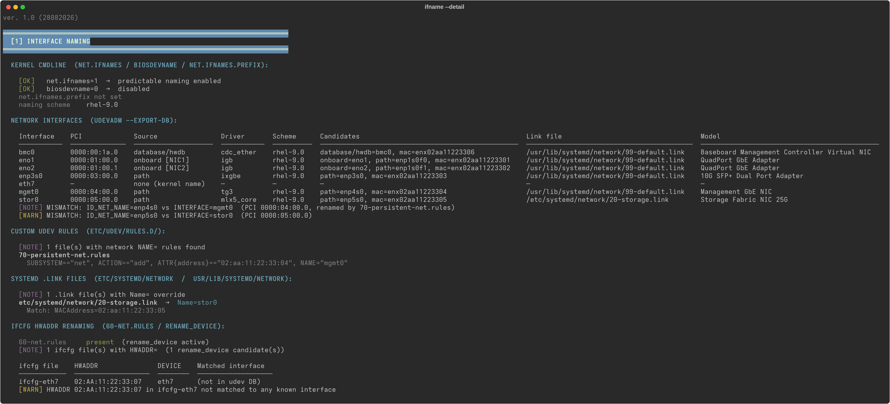

# ifname

Analyzes how network interfaces are renamed by reading a udev database, in the format produced by a sosreport. Not RHEL-specific: it just parses `udevadm info --export-db` output, so it works on any systemd-based Linux distribution (also tested on Fedora). Style and output aligned with its companion tool `sos-net` (`--ifname`/`--ifname-d`).

## In action

`ifname --detail` against a sample system (onboard NICs, a hwdb-named management interface, a rename via custom udev rule, one via a `.link` file, and a legacy ifcfg/HWADDR binding — sample data, not a real system):



## Requirements

- Python 3.9+
- A sosreport (or a plain `udevadm info --export-db` dump) collected on a systemd-based Linux system — RHEL, Fedora, and other distributions

## Installation

```bash
bash install.sh
```

The script is copied to `~/bin/ifname` and made executable. If `~/bin` is not in your `PATH`, the installer prints the line to add to `~/.bashrc`.

After installation, three equivalent modes:

```bash
# 1. from the sosreport root directory (original usage)
cd sosreport-xxx/
ifname
ifname --detail   # or -d

# 2. passing the root directory as an argument (like sos-net)
ifname sosreport-xxx/
ifname sosreport-xxx/ -d

# 3. passing the udev DB file path directly
ifname sosreport-xxx/sos_commands/devices/udevadm_info_--export-db -d
```

## Running without installing

```bash
python3 ifname.py                    # from the sosreport root
python3 ifname.py sosreport-xxx/     # or by passing the path
python3 ifname.py --detail           # or -d, either way
```

## Version

```bash
ifname -v
# ifname version 1.0 (28082026) by manumaiden
```

On every normal run (not `-v`), the version is printed as the first line of output.

## Colors

Output uses the same ANSI colors as `sos-net`: green `[OK]`, yellow `[WARN]`, magenta `[NOTE]`, blue `[INFO]`, cyan/bold headers. Colors auto-disable when output isn't a terminal (pipe, file redirect) and can be turned off explicitly with `--no-color`:

```bash
ifname --no-color sosreport-xxx/
```

## What it analyzes

Output is organized into a single section (`INTERFACE NAMING`) with five subsections:

1. **Kernel cmdline** — `net.ifnames`, `biosdevname`, `net.ifnames.prefix` read from `proc/cmdline`, plus the active naming scheme (`ID_NET_NAMING_SCHEME`)
2. **Interface table** — for every PCI NIC: name, PCI address, how it was renamed (`Source`), driver, scheme, model; `--detail` also shows every naming candidate and the applied `.link` file; any mismatch between `ID_NET_NAME` and `INTERFACE` is flagged, with the responsible udev rule when it can be identified
3. **Custom udev rules** — rules in `etc/udev/rules.d/` that assign `NAME=` to network interfaces
4. **.link files with Name=** — explicit overrides in `etc/systemd/network/` and `usr/lib/systemd/network/`
5. **ifcfg HWADDR renaming** — the legacy `rename_device`/`60-net.rules` mechanism based on `HWADDR=` in `ifcfg-*` files

## Naming logic

The script mirrors the priority used by `systemd-udevd` (highest to lowest):

| Priority | udev property                | Typical prefix | Description                    |
|----------|-------------------------------|-----------------|--------------------------------|
| 1        | `ID_NET_NAME_FROM_DATABASE`   | any              | Name from hwdb (e.g. `idrac`)  |
| 2        | `ID_NET_NAME_ONBOARD`         | `eno*`           | Onboard NIC, firmware slot     |
| 3        | `ID_NET_NAME_SLOT`            | `ens*`           | PCIe hotplug slot              |
| 4        | `ID_NET_NAME_PATH`            | `enp*`           | PCI bus path                   |
| 5        | `ID_NET_NAME_MAC`             | `enx*`           | MAC address                    |
| —        | *(none)*                      | `eth*`           | Kernel name, udev not applied  |

## Files read from the sosreport

| File | Required | Content used |
|------|:---:|-----------------|
| `sos_commands/devices/udevadm_info_--export-db` | Yes | udev properties for every interface |
| `proc/cmdline` | No | `net.ifnames`, `biosdevname`, `net.ifnames.prefix` parameters |
| `etc/udev/rules.d/*.rules` | No | Custom renaming rules |
| `etc/systemd/network/*.link`, `usr/lib/systemd/network/*.link` | No | `.link` files with an explicit `Name=` |
| `usr/lib/udev/rules.d/71-prefixdevname.rules` | No | Checks whether the prefixdevname package is present (only if `net.ifnames.prefix` is set) |
| `etc/sysconfig/network-scripts/ifcfg-*` | No | `HWADDR=`/`DEVICE=` for legacy `rename_device` renaming |
| `usr/lib/udev/rules.d/60-net.rules`, `etc/udev/rules.d/60-net.rules` | No | Presence of the `rename_device` mechanism |

## License

MIT — see [LICENSE](LICENSE).
